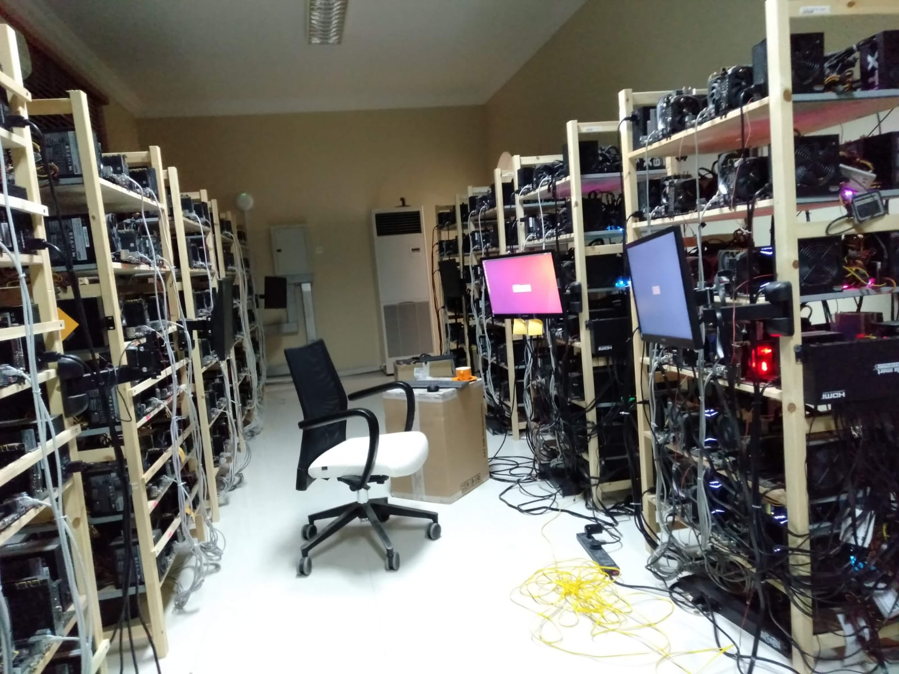
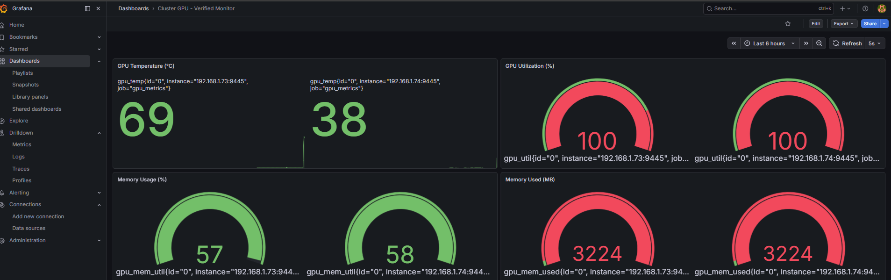

# GPU Cluster Infrastructure Backup (September 2025)

## System Architecture
- **Controller Node:** 192.168.1.10
- **Compute Node 01:** 192.168.1.73 (GTX 1080 Ti)
- **Compute Node 02:** 192.168.1.74 (GTX 1080 Ti)
- **NFS Server:** 192.168.1.75 (Shared Storage)

## Setup Details
1. **Slurm:** Configured for dual-node GPU orchestration.
2. **Monitoring:** Prometheus and Grafana integration via gpu_exporter.
3. **Storage:** NFS shared mount at /home/maas-server/cluster_data.
4. **Stress Testing:** PyTorch-based matrix multiplication scripts included in /scripts.

## Directory Structure
- /slurm: Cluster configuration and inventory.
- /monitoring: Alerting and dashboard metrics.
- /scripts: Job submission files.
- /screenshots: Performance captures showing 100% GPU utilization.

## Hardware Gallery
| Physical Setup | 100% Load Dashboard |
| :---: | :---: |
|  |  |
| *The physical GPU nodes* | *Dual 1080 Ti at full capacity* |
