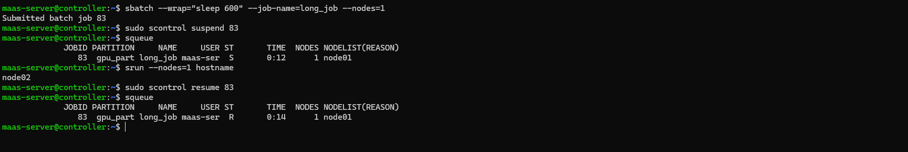

# Scenario 01: Slurm Job Suspend and Resume

**Goal:** Pause a running job to allow an urgent task to finish without losing progress.

### Steps Performed:
1. **Submitted job:** Simulated a long-running workload.
2. **Suspended:** Used `scontrol suspend` (Status changed to 'S').
3. **Verified:** Resources were freed, and a quick `srun` was successful.
4. **Resumed:** Used `scontrol resume` to continue the job ('R' state).

### Evidence:

