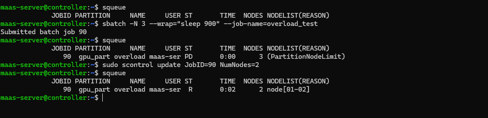

# Scenario 02: Slurm Job Resource Reconfiguration

**Goal:** Fix a pending job stuck due to unavailable resources without canceling it.

### Steps Performed:
1. **Submitted job:** Requested 3 nodes on a 2-node cluster (`-N 3`).
2. **Verified:** Job 88 was in `PD` (Pending) state with `PartitionNodeLimit`.
3. **Updated:** Used `scontrol update JobID=88 NumNodes=2` to match available hardware.
4. **Verified:** Job transitioned immediately to `R` (Running) on `node[01-02]`.

### Evidence:

