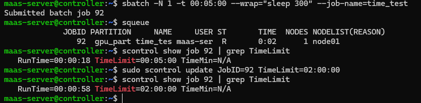

# Scenario 03: Slurm Job Time Limit Extension

**Goal:** Dynamically extend a running job's duration to prevent premature termination and data loss.

### Steps Performed:
1. **Submitted job:** Created a job with a short 5-minute limit (`-t 00:05:00`).
2. **Checked:** Verified current limit using `scontrol show job 92`.
3. **Updated:** Extended the limit to 2 hours using `sudo scontrol update JobID=92 TimeLimit=02:00:00`.
4. **Verified:** Confirmed the live update without interrupting the running process.

### Evidence:

