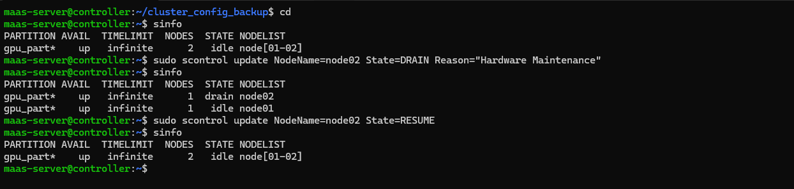

# Scenario 04: Slurm Node Maintenance (Drain and Resume)

**Goal:** Take a node offline for maintenance without affecting the rest of the cluster and bring it back online.

### Steps Performed:
1. **Checked Status:** Verified nodes were active using `sinfo`.
2. **Drained Node:** Put `node02` into maintenance mode using `sudo scontrol update NodeName=node02 State=DRAIN Reason="Hardware Maintenance"`.
3. **Verified:** Confirmed node status changed to `drained` (Jobs will not be scheduled on this node).
4. **Resumed Node:** Brought the node back to active state using `sudo scontrol update NodeName=node02 State=RESUME`.

### Evidence:

